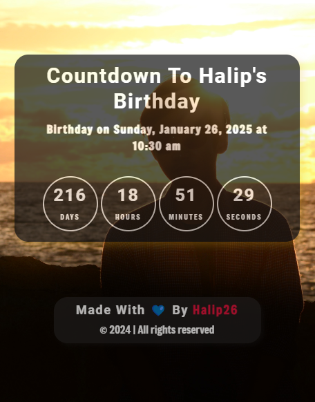

# **Countdown to My Birthday**

This project is a simple yet charming countdown timer designed by [me](https://halip26.github.io/) to celebrate my upcoming birthday. It displays the remaining days, hours, minutes, and seconds in a visually appealing format.

[](https://twitter.com/Halip26)
[](https://www.linkedin.com/in/halipuddin/)
[](https://medium.com/@halip26)

## Preview & link



[See it Live Here](https://halip26.github.io/halips-birthday-countdown/)

---

### 🛠 &nbsp;Languages and Tools

<p>


</p>

<p>

</p>

**Key Features:**

- **Countdown Functionality:** The core component is a dynamic countdown that accurately tracks the time until My birthday.
- **Customizable:** The `script.js` file can be modified to set the target date for the countdown.
- **Responsive Design:** The HTML and CSS ensure that the countdown adapts to different screen sizes, providing a consistent user experience across devices.
- **Clean Code Structure:** The code is well-organized and easy to understand, making it maintainable and adaptable.

**Project Structure:**

```md
countdown-to-aqilah-birthday/
├── index.html  # Main HTML file
├── style.css   # CSS styles for layout and appearance
├── script.js   # JavaScript file for countdown logic
├── images/     # Directory for optional images (e.g., icon.png)
└── README.md  # This file (you're here!)
```

**How to Use:**

1. **Set the Target Date:**
   - Open `script.js` and locate the `targetDate` variable.
   - Update the date string within the quotes to match My birthday.

2. **Run the Project:**
   - Open `index.html` in a web browser.
   - The countdown will automatically start, displaying the remaining time until My birthday.

## Here's a breakdown of the `script.js` code for the countdown timer

**Data Preparation:**

- **Month and Weekday Arrays:**
  - `months`: Stores the names of all months for easy reference.
  - `weekdays`: Stores the names of all weekdays for displaying the day of the week.

- **Date Objects:**
  - `tempDate`: Gets the current date and time.
  - `futureDate`: Sets the target date for the countdown (October 29, 2024, 10:30 AM).

- **Extracting Information:**
  - `year`: Extracts the year from the `futureDate`.
  - `hours`: Extracts the hours from the `futureDate`.
  - `minutes`: Extracts the minutes from the `futureDate`.
  - `month`: Converts the numerical month index to the corresponding month name using the `months` array.
  - `weekday`: Extracts the weekday name from the `futureDate` using the `weekdays` array.
  - `date`: Extracts the date from the `futureDate`.
  - `futureTime`: Converts the `futureDate` to milliseconds for calculations.

**Countdown Logic:**

- **`getRemaindingTime` Function:**
  - `today`: Gets the current time in milliseconds.
  - `remain`: Calculates the remaining time between `futureTime` and `today`.
  - `oneDay`, `oneHour`, `oneMinute`: Constants for converting milliseconds to days, hours, and minutes.
  - `days`, `hours`, `minutes`, `seconds`: Calculate the remaining days, hours, minutes, and seconds.
  - `formatTime` Array: Selects all the `h4` elements within the `.format` class for displaying the time values.
  - `format` Function: Adds a leading zero to values less than 10 for consistent formatting.
  - `forEach` Loop: Iterates through the `formatTime` elements and updates their inner HTML with the formatted time values.
  - `Expired Check`: If `remain` is less than 0 (meaning the birthday has passed), clears the countdown interval and displays an "expired" message.

**Countdown Execution:**

- `countdown` Variable: Stores the interval ID returned by `setInterval`.
- `setInterval(getRemaindingTime, 1000)`: Starts the countdown by calling `getRemaindingTime` every 1000 milliseconds (1 second).

**Initial Values:**

- `getRemaindingTime()`: Calls the function once to set the initial values for the countdown timer.

Overall, this script effectively calculates the remaining time until My birthday and displays it in a user-friendly format, automatically updating every second. It also handles the case where the birthday has passed.
